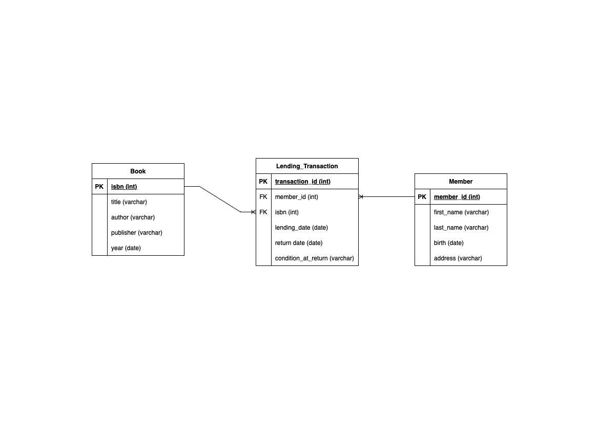
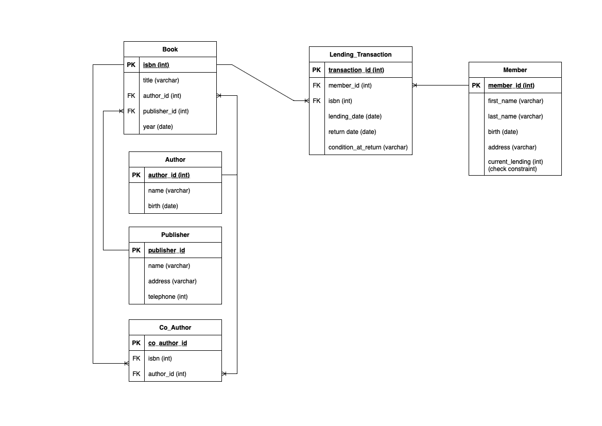

# README

## Analysis

- Membuat tabel bernama Book yang berisi ISBN (Primary), title, author, publisher, dan year.
- Membuat tabel bernama Member yang berisi member_id (Primary), first_name, last_name, birth, dan address.
- Membuat tabel bernama Lending_Transaction yang berisi transaction_id (Primary), member_id (Foreign), isbn (Foreign), lending_date, return_date, condition_at_return. Tabel ini memiliki relasi dengan Tabel Book untuk menghubungkan isbn yang merupakan foreign key, dan Tabel Member untuk menghubungkan member_id yang merupakan foreign key.



## Analysis Alternatif

- Membuat tabel bernama Buku yang berisi ISBN (Primary), Title, Author_ID (Foreign), Publisher_ID (Foreign), dan Year of Publication. Karena Author dan Publisher dapat menerbitkan banyak buku, sehingga lebih baik jika kedua column ini dijadikan foreign key untuk dihubungkan ke tabel lain.
- Membuat tabel bernama Author yang berisi ID (Primary), Name, dan Birth.
- Karena setiap buku dapat memiliki beberapa Co-Author, maka dibuat tabel Co_Author yang berisi ID (Primary), ISBN (Foreign), dan Author_ID (Foreign).
- Karena sebuah publisher dapat menerbitkan banyak baru, maka dibuat tabel bernama Publisher yang berisi ID (Primary), Name, Address, dan Telephone. Sehingga jika ada buku yang perlu direstorasi, pihak perusahaan dapat menghubungi publisher.
- Membuat tabel bernama Member yang berisi ID (Primary), First_Name, Last_Name, Birth, Address, dan Current_Lending. Current_Lending memiliki check constraint sehingga jumlah maksimal buku yang dipinjam adalah 5.
- Membuat tabel bernama Borrow yang berisi ID (Primary), Member_ID (Foreign), ISBN (Foreign), Lending_Date, dan Return_Date, Condition_at_Return.



## Setup Queries

### Create Database

```sql
CREATE DATABASE setup;
```

### Create Tables

```sql
CREATE TABLE IF NOT EXISTS book (
    isbn INT AUTO_INCREMENT NOT NULL,
    title VARCHAR(100) NOT NULL,
    author VARCHAR(100) NOT NULL,
    publisher VARCHAR(100) NOT NULL,
    year DATE NOT NULL,
    PRIMARY KEY (isbn)
);

CREATE TABLE IF NOT EXISTS member (
    member_id INT AUTO_INCREMENT NOT NULL,
    first_name VARCHAR(100) NOT NULL,
    last_name VARCHAR(100),
    birth DATE,
    address VARCHAR(255),
    PRIMARY KEY (member_id)
);

CREATE TABLE IF NOT EXISTS lending_transaction (
    transaction_id INT AUTO_INCREMENT NOT NULL,
    member_id INT NOT NULL,
    isbn INT NOT NULL,
    lending_date DATE NOT NULL,
    return_date DATE,
    condition_at_return VARCHAR(100),
    PRIMARY KEY (transaction_id),
    FOREIGN KEY (member_id) REFERENCES member(member_id),
    FOREIGN KEY (isbn) REFERENCES book(isbn)
);
```

### Delimiter

#### Adding a constraint to ensure a member can't borrow more than 5 books at a time

```sql
DELIMITER //
CREATE TRIGGER Before_LendingTransaction_Insert
BEFORE INSERT ON lending_transaction
FOR EACH ROW
BEGIN
    DECLARE BorrowedBooksCount INT;
    
    SELECT COUNT(*) INTO BorrowedBooksCount
    FROM lending_transaction
    WHERE member_id = NEW.member_id AND return_date IS NULL;
    
    IF BorrowedBooksCount >= 5 THEN
        SIGNAL SQLSTATE '45000' SET MESSAGE_TEXT = 'A member cannot borrow more than 5 books at a time';
    END IF;
END;
//
DELIMITER ;
```

## Insert Values

### Member Table

```sql
INSERT INTO member (first_name, last_name, birth, address)
VALUES 
    ('John', 'Doe', '2001-09-11', 'Jalan Cemara'),
    ('Daniel', 'Rahmanto', '2001-05-14', 'Jalan Asri'),
    ('Foo', 'Bar', '1999-09-09', 'Jalan Perjuangan');
```

### Books

```sql
INSERT INTO book (title, author, publisher, year)
VALUES 
    ('Pengantar Biologi', 'Budi', 'Erlangga', '2000-01-01'),
    ('Fisika', 'Andi', 'Pearson', '2014-05-14'),
    ('Kalkulus', 'Arjo', 'Kompas', '2010-09-11');
```

### Transaction

```sql
INSERT INTO lending_transaction (isbn, member_id, lending_date, return_date, condition_at_return)
VALUES
    (1, 1, '2023-09-07', NULL, NULL),
    (1, 2, '2023-08-10', '2023-08-14', 'Good'),
    (2, 1, '2023-06-10', '2023-07-10', 'Bad'),
    (3, 3, '2023-08-21', '2023-08-28', 'Good'),
    (3, 1, '2023-09-07', NULL, NULL),
    (2, 3, '2023-05-10', '2023-05-14', 'Bad')
```

## Queries

### Query 1: List the titles of books borrowed by a member (identified by a specific Member_ID).

```sql
SELECT title 
FROM book
INNER JOIN lending_transaction
ON book.isbn = lending_transaction.isbn
WHERE member_id = 1;
```

### Query 2: Find out the members who have borrowed books but have not returned yet.

```sql
SELECT DISTINCT first_name, last_name, title
FROM member
INNER JOIN lending_transaction
ON member.member_id = lending_transaction.member_id
INNER JOIN book
ON lending_transaction.isbn = book.isbn
WHERE lending_transaction.return_date IS NULL;
```

### Query 3: Find out the total number of books borrowed by a member (identified by a specific Member_ID)

```sql
SELECT first_name, last_name, 
COUNT(first_name) AS books_borrowed
FROM member
INNER JOIN lending_transaction
ON member.member_id = lending_transaction.member_id
WHERE lending_transaction.member_id = 1;
```


### Query 4: List the books which were not returned in good condition.

```sql
SELECT DISTINCT title
FROM book
INNER JOIN lending_transaction
ON book.isbn = lending_transaction.isbn
WHERE lending_transaction.condition_at_return = 'Bad';
```

## Query 5: Identify members who have borrowed more than one book at a time.

```sql
SELECT member.member_id, member.first_name, member.last_name, lending_transaction.lending_date, COUNT(*) AS books_lent
FROM member
INNER JOIN lending_transaction 
ON member.member_id = lending_transaction.member_id
GROUP BY member.member_id, lending_transaction.lending_date
HAVING books_lent > 1;
```